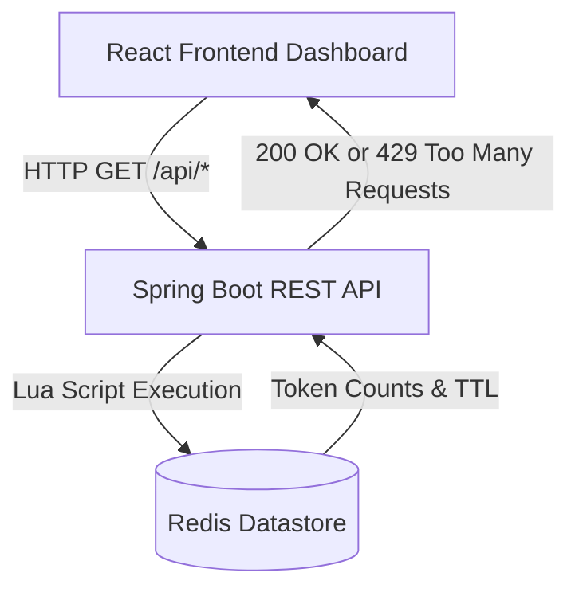

# RateStream: Distributed Rate Limiter 🚀

RateStream is a full-stack distributed rate-limiting system designed to protect APIs from abuse and manage traffic effectively. It implements the **Token Bucket algorithm** using **Redis Lua scripts** to ensure atomic and highly performant rate limiting across multiple instances.

## 🏗️ Architecture

The application follows a clean Client-Server architecture, separated into a robust Spring Boot backend and a modern React frontend dashboard.



### 1. Backend (Spring Boot + Java)
*   **Framework:** Spring Boot 3.x
*   **Rate Limiting Algorithm:** Token Bucket. Each user gets a predefined maximum number of tokens, which refill at a consistent rate.
*   **Distributed Storage:** Redis. Atomic operations are guaranteed using Lua scripts, preventing race conditions even if multiple backend instances are scaled horizontally.
*   **Key APIs:**
    *   `GET /api/resource?userId={id}`: Core endpoint. Consumes a token. Returns `200 OK` if allowed, or `429 Too Many Requests` if blocked (with a `Retry-After` header).
    *   `GET /api/admin/stats?userId={id}`: Inspects the current bucket state for a user without consuming tokens.
    *   `GET /api/admin/metrics`: Exposes global metrics (Allowed vs. Blocked request counts).

### 2. Frontend (React + Vite)
*   **Framework:** ReactJS (JavaScript, no TypeScript), bootstrapped with Vite for maximum speed.
*   **Styling:** Clean, minimalist Vanilla CSS UI built without heavy frameworks. 
*   **Data Visualization:** Chart.js integration (`react-chartjs-2`) for real-time traffic monitoring of allowed vs. blocked requests.
*   **Network Requests:** Axios for API communication, including custom error handling for `429 Too Many Requests` and `503 Service Unavailable` statuses.

## 🚀 Getting Started

### Prerequisites
*   [Node.js](https://nodejs.org/) (v20+ or v22.12+)
*   [Java 17+](https://adoptium.net/) & Maven
*   [Redis Server](https://redis.io/download) running on `localhost:6379`

### 1. Start Redis
Ensure your Redis instance is up and running on the default port (`6379`).
*(On Windows, you can use Docker: `docker run -p 6379:6379 -d redis`)*

### 2. Start the Backend
Navigate to the backend directory and run the Spring Boot application:
```bash
cd Backend
mvn spring-boot:run
```
The backend will start on `http://localhost:8080`.

### 3. Start the Frontend
Navigate to the frontend directory, install dependencies, and start the development server:
```bash
cd frontend
npm install
npm start
```
The frontend dashboard will be available at `http://localhost:5173`.

## 📸 Dashboard Features
*   **User Simulator:** Send mock requests for specific users to test rate limiting in real-time.
*   **Status Viewer:** Instant feedback indicating if a request was accepted or blocked, along with remaining tokens and retry windows.
*   **Live Metrics:** A real-time updating Line Chart showing global allowed vs. blocked traffic history.